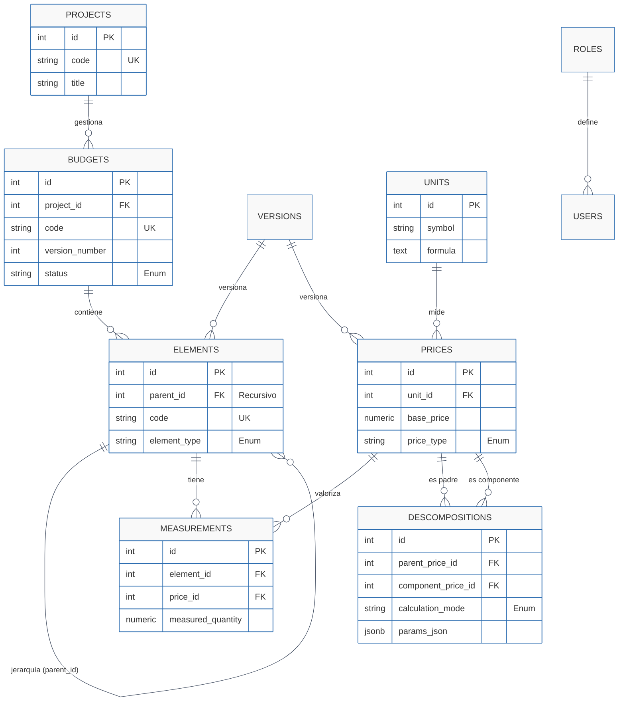

# Presu


[](https://opensource.org/licenses/MIT)
[](https://github.com/tu_usuario/tu_repositorio/actions)

Presu es una aplicación de presupuestos y gestión de proyectos. Está diseñada para ser una herramienta potente y flexible para profesionales y empresas que necesitan crear, gestionar y realizar un seguimiento de los presupuestos de sus proyectos.

## Características principales

- **Gestión de Proyectos y Presupuestos**: Cree proyectos y, dentro de cada uno, gestione múltiples versiones de presupuestos de forma independiente. Realice un seguimiento del estado de cada presupuesto (`borrador`, `aprobado`, `rechazado`, etc.).

- **Estructura Jerárquica de Presupuestos**: Organice los presupuestos en una estructura de árbol con capítulos y partidas (`elements`), permitiendo una descomposición del trabajo clara y detallada.

- **Catálogo de Precios Centralizado y Versionado**: Administre múltiples versiones de sus catálogos de precios. Cada proyecto se vincula a un catálogo base, con la flexibilidad de anularlo para partidas específicas.

- **Análisis de Precios Unitarios (APU)**: Defina precios complejos que se descomponen en una combinación de otros precios (por ejemplo, materiales, mano de obra, maquinaria), lo que permite un análisis de costes detallado y preciso.

- **Mediciones Parametrizadas y Calculadas**: Vaya más allá de las cantidades simples. Defina mediciones utilizando fórmulas y parámetros (por ejemplo, calculando el área a partir del largo y el ancho directamente en la línea de medición).

- **Gestión de Usuarios y Roles**: Controle el acceso y los permisos con un sistema basado en roles (`admin`, `master`, `writer`, `reader`), garantizando la seguridad de los datos y un flujo de trabajo adecuado.

## Tecnología

Presu está construido con un stack de tecnología moderno y robusto:

- **Backend**: Desarrollado en **Rust**, utilizando el framework web **Axum** para un rendimiento y seguridad excepcionales. La interacción con la base de datos se realiza a través de **SQLx**.
- **Frontend**: Una aplicación de página única (SPA) creada con **React**, **Vite** y **TypeScript**, que ofrece una experiencia de usuario rápida y fluida.
- **Base de datos**: Utiliza **PostgreSQL** para el almacenamiento de datos persistente.

## Puesta en marcha

Para ejecutar el proyecto en su entorno de desarrollo local, siga estos pasos:

### Prerrequisitos

- [Rust](https://www.rust-lang.org/tools/install)
- [Node.js](https://nodejs.org/) y [pnpm](https://pnpm.io/installation)
- [Docker](https://www.docker.com/get-started) (para la base de datos)
- [Just](https://github.com/casey/just) (un ejecutor de comandos)

### Pasos

1.  **Clonar el repositorio:**

    ```bash
    git clone <URL_DEL_REPOSITORIO>
    cd presu
    ```

2.  **Configurar las variables de entorno:**

    Copie el archivo `.env.example` a `.env` tanto en el directorio `backend` como en el `frontend` y rellene las variables necesarias. Como mínimo, necesitará configurar la `DATABASE_URL` para el backend.

3.  **Iniciar la base de datos:**

    Puede utilizar Docker para iniciar una instancia de PostgreSQL:

    ```bash
    docker run --name presu-db -e POSTGRES_PASSWORD=mysecretpassword -p 5432:5432 -d postgres
    ```

4.  **Ejecutar las migraciones de la base de datos:**

    Desde el directorio `backend`, ejecute:

    ```bash
    sqlx migrate run
    ```

5.  **Instalar dependencias y ejecutar la aplicación:**

    La forma más sencilla de iniciar el entorno de desarrollo es utilizando el `justfile` proporcionado. Este comando instalará las dependencias del frontend, construirá el frontend, copiará los archivos estáticos al backend y finalmente iniciará el servidor del backend.

    ```bash
    just dev
    ```

    Alternativamente, puede ejecutar el frontend y el backend por separado en diferentes terminales:

    -   **Para el frontend:**
        ```bash
        [working-directory("./frontend")]
        pnpm install
        pnpm run dev
        ```

    -   **Para el backend:**
        ```bash
        [working-directory("./backend")]
        cargo run
        ```

Una vez que todo esté en marcha, la aplicación frontend debería ser accesible en `http://localhost:5173` y el servidor backend en `http://localhost:3000`.

## Estructura del proyecto

```
.
├── backend/        # Aplicación Rust (Axum)
│   ├── migrations/ # Migraciones de la base de datos (SQLx)
│   ├── src/        # Código fuente del backend
│   └── Cargo.toml
├── frontend/       # Aplicación React (Vite)
│   ├── src/        # Código fuente del frontend
│   └── package.json
├── .justfile       # Comandos del proyecto
├── Dockerfile      # Para construir la imagen de producción
└── README.md
```

## Diagrama de la base de datos

A continuación se muestra un diagrama de Entidad-Relación que representa la estructura de la base de datos.


